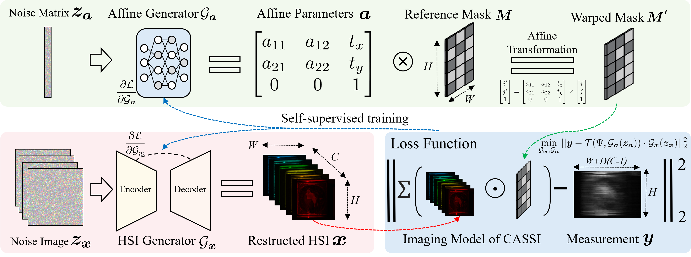
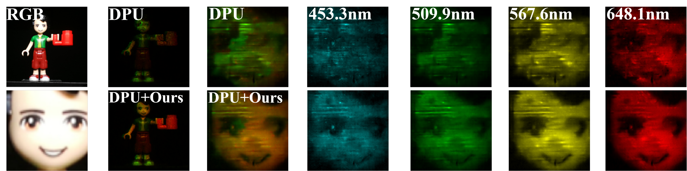

<div align="center">

# SGDE: Self-supervised Geometry Degradation Estimation Framework for Coded Aperture Compressive Spectral Imaging

Yuqiao He, Xiaoyan Liu, Jianxu Mao, Yaonan Wang, Hui Zhang, [Lizhu Liu](https://github.com/liuli33), [Yurong Chen](https://github.com/YurongChen1998), Wenbin He

</div>

This repo is the implementation of paper "SGDE: Self-supervised Geometry Degradation Estimation Framework for Coded Aperture Compressive Spectral Imaging" (CVPR 2026)


## 📌 Overview

SGDE is a self-supervised framework for CASSI systems that jointly:

- ✅estimates mask misalignment

- ✅reconstructs hyperspectral images

directly from measurements without requiring:

- ❌ reference targets

- ❌ modification to network architecture

- ❌ retraining required

SGDE is Plug-and-play and Compatible with most existing methods ([MST](https://github.com/caiyuanhao1998/MST), [MIDET](https://github.com/xgiaogiao/MIDET), [DERNN-LNLT](https://github.com/ShawnDong98/DERNN-LNLT), [RDLUF_MixS2](https://github.com/ShawnDong98/RDLUF_MixS2), [MIDET](https://github.com/xgiaogiao/MIDET), [DPU](https://github.com/ZhangJC-2k/DPU))





## 📁 Directory Structure

```
SGDE/   
├── Data/                       # Hyperspectral datasets
│     ├── KAIST/                # Simulated dataset (with GT)
│     ├── Our_1/                # Our self-build Scene 01-02
│     ├── Our_2/                # Our self-build Scene 03-05
│     ├── Our_3/                # Our self-build Scene 06
│     └── TSA/                  # TSA Scene 01-05
│
├── Demo/                       # Integration demos
│     ├── Estimated TSA mask/   # The TSA Mask aligned by our code. 
│     ├── DERNN-LNLT/           # DERNN + SGDE
│     └── MIDET/                # MIDET + SGDE
│
├── figure/                      # figure of README.md
├── Results/                    # Output directory for reconstructed spectral images
│
├── func.py                     # Utilities for forward model and pre/post-processing
├── optimization.py             # Forward model, mask operations, and utilities
├── modeal/                     # Model definition for CASSI reconstruction
│
├── main_KAIST.py               # for KAIST dataset experiments
├── main_Our.py                 # for Our self-build dataset experiments
├── main_TSA.py                 # for TSA dataset experiments
│
└── README.md                   # Project documentation and usage instructions
```
## 📷 Our self-build dataset
During real data capture, to avoid cumulative disturbances, we recalibrated the system. Therefore:
- The dataset contains three different masks
- Each mask corresponds to a subset of scenes

If the reconstruction results appear too dark or exhibit flickering, you can crop out the image borders.
```Python
import scipy.io as sio
data = sio.loadmat("Result/test.mat")
img = data['img'][15:-15, 15:-15, :]
```

## 📁 TSA Dataset Support
We provide estimated mask for TSA dataset

[./Demo/Estimated TSA mask/mask.mat](./Demo/Estimated TSA mask)


## 🚀 Getting Started
### 1 Clone the Repository
Begin by cloning the repository to your local machine:

```Bash
git clone https://github.com/heyuqiao/SGDE
cd SGDE
```

### 2 prepare the environment
```Bash
conda create -n sgde python=3.10
conda activate sgde
pip install -r requirements.txt
```

### 3 Run SGDE
```Bash
cd LCTC_4FastLineScan
python main_TSA.py
```


## 🔧 How to Use SGDE in Your Own Pipeline

You can use our result in two ways:

✅ Option 1: Replace Mask Directly (Recommended)
After running SGDE:
```
./Results/mask.mat
./Results/mask_3d_shift.mat
```
Simply replace your original mask with the estimated one.

✅ Option 2: Apply Affine Transformation in Forward Model
See examples:

[./Demo/DERNN-LNLT/test_real.py (line 94)](./Demo/DERNN-LNLT/test_real.py)

[./Demo/MIDET/real/test_code/test.py (line 83)](./Demo/MIDET/real/test_code/test.py)


## 🙏 Acknowledgement
This project builds upon:
- [LCTC](https://github.com/YurongChen1998/LCTC)
- [SelfDeblur](https://github.com/csdwren/SelfDeblur)
- [BD_noise_robust_kernel_estimation](https://github.com/csleemooo/BD_noise_robust_kernel_estimation)
- [MIDET](https://github.com/xgiaogiao/MIDET)
- [DERNN-LNLT](https://github.com/ShawnDong98/DERNN-LNLT)
- [TSA-Net](https://github.com/mengziyi64/TSA-Net)

We sincerely thank the authors for their excellent work.


## 📬 Contact
For questions, please contact:

* Yuqiao He (何宇桥)
* Hunan University
* Email: heyuqiao@hnu.edu.cn


## 📖 Citation
If you find our code useful, please star ⭐ this repository and consider citing:
```
@inproceedings{he2026sgde,
  title={SGDE: Self-supervised Geometry Degradation Estimation Framework for Coded Aperture Compressive Spectral Imaging},
  author={He, Yuqiao and Liu, Xiaoyan and Mao, Jianxu and Wang, Yaonan and Zhang, Hui and Liu, Lizhu and Chen, Yurong and He, Wenbin},
  booktitle={Proceedings of the IEEE/CVF Conference on Computer Vision and Pattern Recognition},
  pages={34084--34094},
  year={2026}
}
```